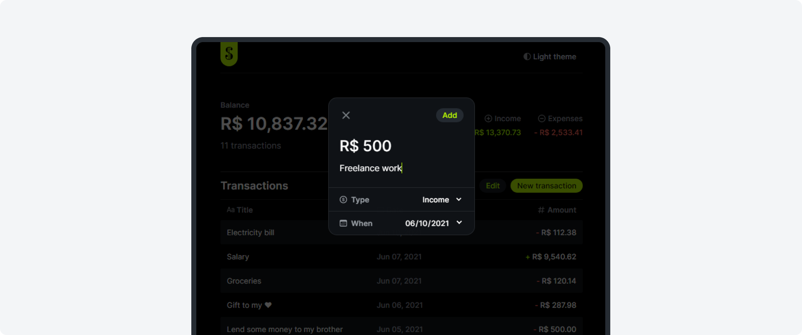
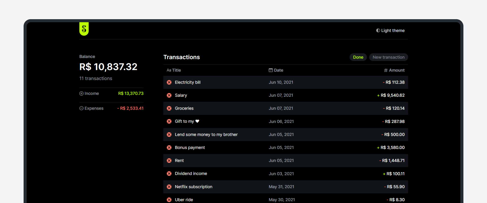
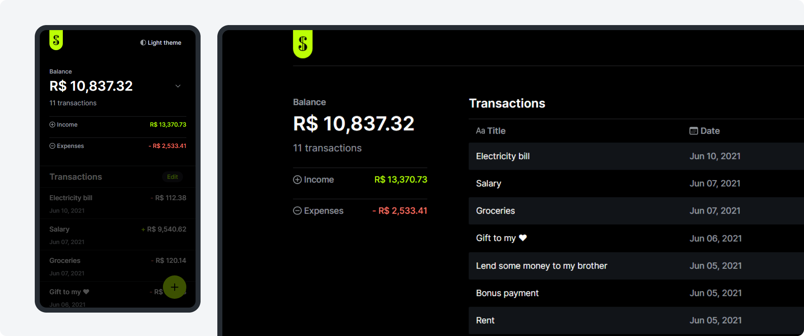
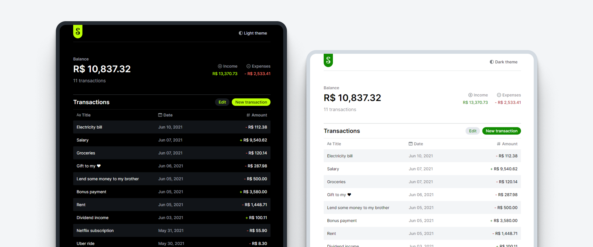
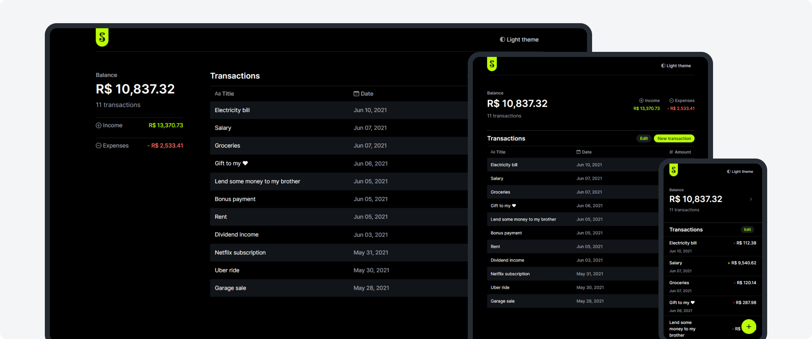

# Sage budget tracking web app

In this project, an interactive page was developed using **HTML**, **CSS** and **JavaScript** - for building the page and its functionality, - and the **Web Storage API** for storing transactions and user preferences data. [Interact with the live project here](https://douglasf5.github.io/mini-budget-tracking-web-app/).

## Features overview:

### **Transactions creation**

Add new transactions through a simple and clean UI.

 

### **Transactions deletion**

Turn on the deletion mode to see controls for removing individual transactions.

 

### **Simple data summary**

Stats calculated automatically based on created transactions.

 

### **UI theming**

Light and dark UI implemented by leveraging CSS custom properties and DOM manipulation using JavaScript.

 

### **Responsive layout**

With the power of CSS layout features page components have their style, size, position and visibility changed in order to better adapt to different screen sizes.

 

## Extra notes

- As a beginner exercise, this project wasn’t focused on advanced optimizations regarding data storage, processing, accessibility, scalability, cross-browser compatibility, etc. There’s still a lot to be done about it.
- This project was proposed by Rocketseat during one of their free courses.
- The UI was completely redesigned for this exercise.
- As most projects, this one is not bug/error-free. If you find any bug or unexpected behavior, feel free to get in touch, here is my email - dfaferreira46@gmail.com
